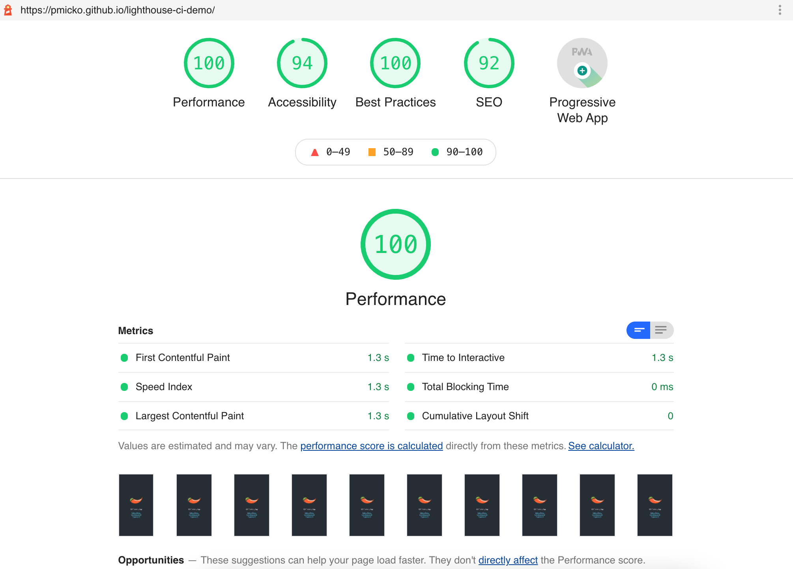

# Lighthouse CI Demo


## 🤔 What is it
Companion repo for my demo of [Lighthouse CI](https://github.com/treosh/lighthouse-ci-action) running on Github Actions environment.

## 🚀 What does it do
- Provides performance audit after every commit and uploads results as a job artifact.


- Tests performance of app by asserting results with expected min/max values of performance categories. In this example it is 3 metrics:
  - overall score of performance
  - first-contentful-paint
  - first-meaningful-paint
```json
{
  "ci": {
    "assert": {
      "assertions": {
        "first-contentful-paint": ["warn", { "maxNumericValue": 3000 }],
        "first-meaningful-paint": ["warn", { "maxNumericValue": 5000 }],
        "categories:performance": ["warn", { "minScore" : 0.9 }]
      },
      "includePassedAssertions" : false
    }
  }
}
```

## 💡 How does it do
- Configured workflow file: [.github/workflows/main.yml](https://github.com/pmicko/lighthouse-ci-demo/blob/master/.github/workflows/main.yml)
- Lighthouse config with basic setup: [lighthouserc.json](https://github.com/pmicko/lighthouse-ci-demo/blob/master/lighthouserc.json)

## 📝 Notes
Tested app is a [create-react-app](https://github.com/facebook/create-react-app) with slightly modified content
